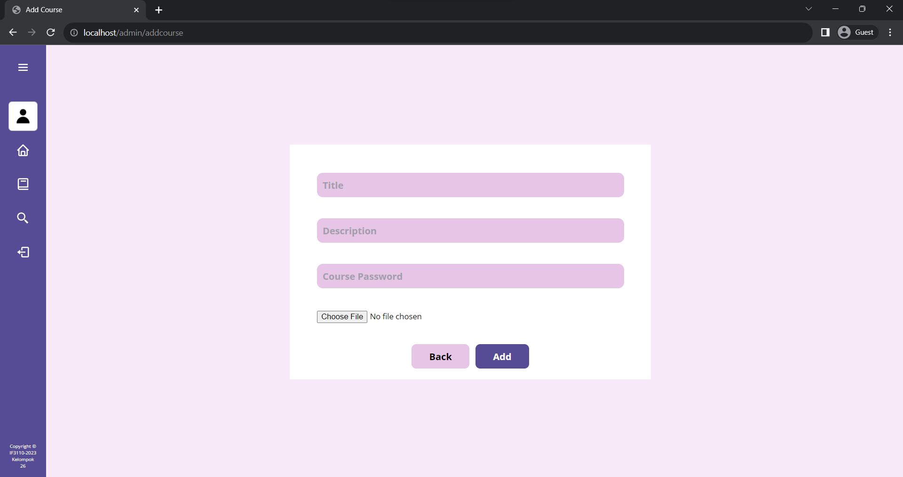

# LeMeS

> Disusun untuk memenuhi Tugas Milestone 1 - Monolithic PHP & Vanilla Web Application IF3110 Pengembangan Aplikasi Berbasis Web

## Daftar Isi

-   [Deskripsi Aplikasi Web](#deskripsi-aplikasi-web)
-   [Daftar Requirement](#daftar-requirement)
-   [Cara Instalasi](#cara-instalasi)
-   [Cara Menjalankan Server](#cara-menjalankan-server)
-   [Screenshot Tampilan Aplikasi](#screenshot-tampilan-aplikasi)
-   [Pembagian Tugas](#pembagian-tugas)

## Deskripsi Aplikasi Web

*LeMeS* merupakan sebuah aplikasi web pembelajaran yang mirip dengan Edunex.
Pengguna dapat mengakses berbagai modul dan materi pembelajaran yang terdapat dalam berbagai kursus yang ditawarkan. *LeMeS* menghadirkan fitur manajemen kursus bagi admin dan pengajar untuk menambah, mengubah, dan menghapus kursus. Admin dapat melihat daftar pengguna yang mengakses web ini dan pengajar dapat melihat daftar kursus yang ditawarkan.

## Daftar Requirement

1. Login
2. Register
3. Homepage
4. Daftar Course
5. Search, Sort, dan Filter
6. Edit Course
7. Detail Course
8. Tambah Course
9. Tambah Modul
10. Edit Modul
11. Delete Modul
12. Daftar User
13. Edit Profil
14. Tambah Materi
15. Hapus Materi
16. Edit User

## Cara Instalasi

1. Lakukan pengunduhan repository ini dengan menggunakan perintah `git clone https://gitlab.informatika.org/if3110-2023-01-26/tugas-besar-1.git` pada terminal komputer Anda.
2. Pastikan komputer Anda telah menginstalasi dan menjalankan aplikasi Docker.

## Cara Menjalankan Server

1. Anda dapat menjalankan program ini dengan menjalankan perintah `docker-compose up -d` pada terminal directory aplikasi web.
2. Aplikasi web dapat diakses dengan menggunakan browser pada URL `http://localhost/course/lists/page=1`atau dengan memasukkan `http://localhost/`.
3. Aplikasi web dapat dihentikan dengan menjalankan perintah perintah `docker-compose down` pada terminal directory aplikasi web.
4. Buat file .env di root folder
5. Copy .env.example ke dalam file .env dan pastikan isinya sama dengan app/core/Database.php

## Screenshot Tampilan Aplikasi

### Login

### Register

### Home

### Daftar User

### Pop Up

### Search, Sort, dan Filter

### Enroll

### Add Course

### Not-Found

### Search Page

### Lighthous

## Pembagian Tugas

### _Server Side_

| Fitur                         | NIM      |
| ------------------------------| -------- |
| Database and Container Setup  | 13521139 |
| Routing                       | 13521139 |
| Login                         | 13521139, 13521161 |
| Register                      | 13521139, 13521161 |
| Update Profile                | 13521164 |
| Admin CRUD List Courses       | 13521139 |
| Admin CRUD List Users         | 13521139 |
| Enroll Course Process         | 13521139 |
| Add Module                    | 13521161 |
| CRUD Modules                  | 13521164 |
| CRUD Materials                | 13521164 |
| Logout                        | 13521139 |
| Modals                        | 13521139 |
| Middleware                    | 13521139 |
| Not Found                     | 13521161 |

### _Client Side_

| Fitur                                 | NIM      |
| ------------------------------------- | -------- |
| Login                                 | 13521139, 13521161 |
| Register                              | 13521139, 13521161 |
| Homepage and Card Courses             | 13521164 |
| Navbar                                | 13521139, 13521164 |
| Course Detail                         | 13521139, 13521164 |
| Module Detail                         | 13521164 |
| Material Detail (Accordion)           | 13521164 |
| Not Found                             | 13521161 |
| Add Module                            | 13521164 |
| Admin Dashboard                       | 13521139 |
| Search Page                           | 13521139 |
| User List Admin                       | 13521139, 13521161 |
| Course List Admin                     | 13521139, 13521164 |
| Pagination, Search Bar, Filter, Sort  | 13521161, 13521164 |
| Logout Popup                          | 13521164 |
| Popup Windows Add, Delete, Edit       | 13521161, 13521164 |

## Fitur Tambahan 
1. Fitur Upgrade ke premium
2. Fitur melihat course premium
3. Fitur melihat material premium
4. Fitur melihat material premium

## Pembagian Tugas
### _Server Side_

| Fitur                          | NIM      |
| -------------------------------| -------- |
| Upgrade ke premium             | 13521139 |
| Fitur melihat course premium   | 13521139 |
| Fitur melihat modul premium    | 13521139 |
| Fitur melihat material premium | 13521139 |
| Premium middleware             | 13521139 |

### _Client Side_
| Fitur                          | NIM      |
| -------------------------------| -------- |
| Upgrade ke premium             | 13521139 |
| Fitur melihat course premium   | 13521139 |
| Fitur melihat modul premium    | 13521139 |
| Fitur melihat material premium | 13521139 |
